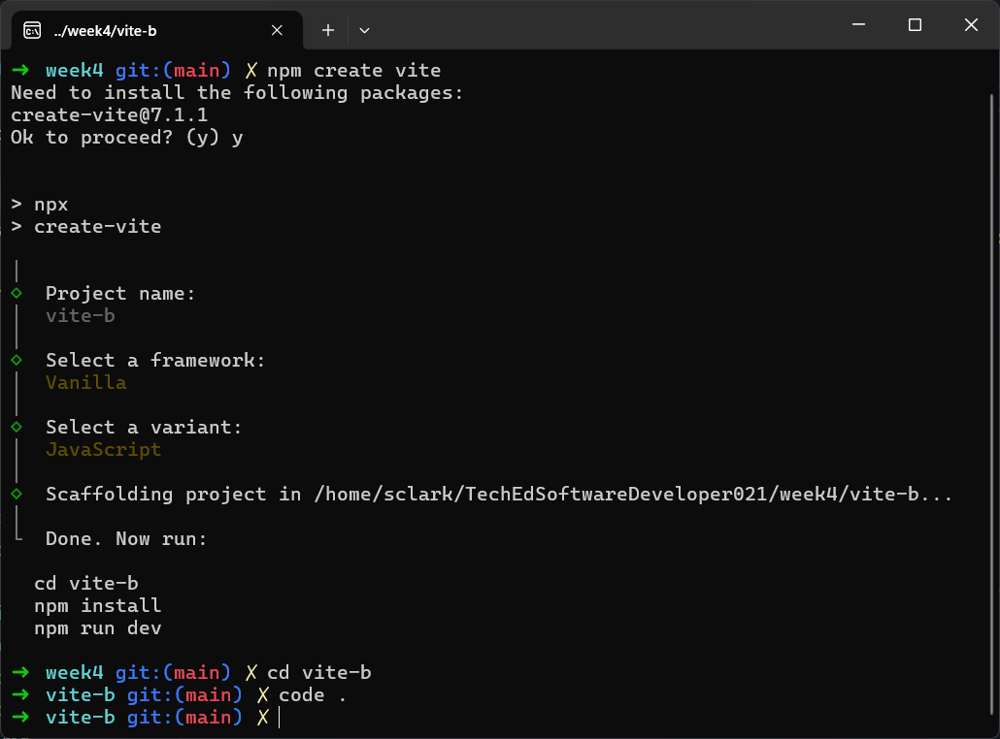

# JavaScript may seem simple on the surface, but there’s a sophisticated system managing what rus when.

- Call Stack: Executes one function at a time (LIFO).
- Web API’s: Handle async browser taks like timers and network requests.
- Callback Queue: Stores tasks from Web APIs to run after the stack is empty.
- Microtask Queue: Stores higher-priority tasks like Promises and async/await.
- Event Loop: Manages everything - checking queues and moving tasks to the stack when it’s free.

# Network Tab

- The “Network tab” shows all the requests your browser makes to the web, including page loads, data fetching, images to display and more. Understanding how to read the network tab becomes very useful for debugging network requests when submitting data from your app to a server.

# Git Branching

#### Step by Step

- Create Repo on GitHub (tick the Add a Readme box)
- Add your new best bud as a collaborator
- They need to accept the invitation before you carry on!
- Both clone the repo on your computer git clone thelinktoyourrepo

#### Checkpoint

- One person checkout a branch git checkout -b thenameofbranch (-b makes a new branch, checkout puts you ON that branch)
- That person makes a few changes to the files (whatever you want to do)
- They then ACP (add, commit & push). BUT make sure you push to the branch you’re on git push origin thenameofbranch
- Go to GitHub
- Click the button that has appeared at the top of your repo
- Create the pull request
- Either person can now merge the pull request
- Both people now run git checkout main and git pull to make sure they have the most up-to-date version.
- Go back to the CHECKPOINT and begin again, but it’s the other person’s turn now

# Terminal commands

- ~ - Means you're in the 'root' directory/folder
- ls - 'list' - how you see all the folders/files in your folder.
- cd foldername - 'change directory' moves you into the folder you've chosen.
- cd .. - to go back up a level in your folder (go back)
- mkdir foldername - makes a folder
- code . - to open folder in vscode

# Vite

- Instead of using `npm create vite`, use `npm create vite@latest` as that will use the most up-to-date version of Vite.

# CRUD - HTTP Method

- Create - POST
- Read - GET
- Update - PUT
- Delete - DELETE

# Using packages on two pc

When you clone a repository that uses a .gitignore file, the ignored files, such as the node_modules folder, aren't included in the clone. To get your project working on your second PC, you need to reinstall these dependencies. The simplest way to do this is by using the package manager you used on your first PC, like npm or yarn.

#### Reinstalling Node.js Dependencies

To get your project running on your new computer, follow these simple steps:

- Open a terminal or command prompt within the project directory on your second PC. You can do this directly in VS Code by going to Terminal > New Terminal.

- Run the appropriate command for your package manager.

  - If you used npm, run: npm install
  - If you used yarn, run: yarn install

This command will read the package.json file in your project, which lists all the necessary dependencies. It then downloads and installs them into a new node_modules folder, setting up your project just as it was on your first computer.
